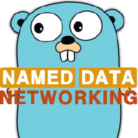
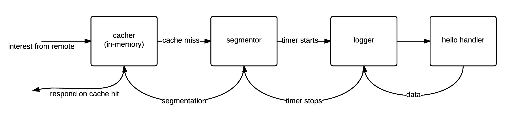
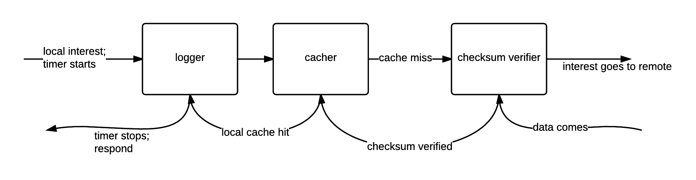

<p align="center"></p>

# What is "go-ndn"?

In short, go-ndn is __named data networking (NDN)__ implemented in go. The goal of this project is to provide one simple, fast and open-source NDN framework that you can _write your app once and deploy it everywhere_.

The key benefits are:

- short build time
- easy deployment with static compilation
- concurrency support
- compatible with other ndn tools
- various supported OSs (FreeBSD, Windows, Mac, and Linux) and architectures (amd64, and arm).
- tiny codebase

If you have related questions, or need help to use go-ndn in your research/product, please contact `tailinchu <at> gmail <dot> com`. We welcome you to join the eco-system.

## News

### next

- [go-ndn TLV extension](tlv-extension.md)

### 2016-02-21

- Release `1.3`
  - [Raft distributed consensus protocol with NDN transport](https://github.com/go-ndn/raft)
  - optimize scheduled pit removal
  - optimize lpm object allocation
  - add `mux.Publisher` to push data to content store with middleware

### 2015-11-28

- Release `1.2`
  - __ndn "send/push" semantics__ (Oli Gavin): This is an experimental protocol based on interest pattern `<nodeName>/ACK/<dataName>`. A producer will use this interest pattern to ensure that a specific node receives a specific data packet (see `mux.Notify` and `mux.Listener`).
  - add go-ndn node [health monitoring tool](https://github.com/go-ndn/health)
  - refactor go-nfd middleware (Oli Gavin)
  - fix tlv cannot unmarshal time.Time (reported by qhsong)
  - fix stale data in go-nfd content store (reported by Mahyuddin Husairi)
- Tutorial
  - [Generate Data Before Interest](publish.md)

### 2015-10-15

- Release `1.1`
  - refactor `packet` and `tlv` package for significantly less memory allocation. ([before](bench/2015-09-13.svg) and [after](bench/2015-09-27.svg))
  - experimental ndn certificate format
  - update verify (rsa, ecdsa, sha256, crc32c and hmac) and encrypt (RSA-OAEP and AES-CTR) middleware
- Tutorial
  - [Verify Data Packet](verify.md)
  - [Encrypt Data Packet](encrypt.md)

### 2015-09-13

- First public stable release `1.0`

# Create Your First NDN App

This tutorial follows the `80-20 rule`; it will teach you 80% of go-ndn in 20% of the time. Let the hacking begin!

<p align="center"></p>

## Step 0: Install Go

Go to [`http://golang.org`](http://golang.org) and setup your go development environment. After you are done, run:

```
go get -u github.com/go-ndn/example/...
go get -u github.com/go-ndn/nfd
go get -u github.com/go-ndn/ndn-cert-gen
```

Now we have one consumer/producer example, NDN forwarding daemon (nfd), and certificate creation tool (ndn-cert-gen).

## Step 1: Create a Producer

By importing `"github.com/go-ndn/mux"`, you get a modern NDN framework that is similar to express and sinatra. In general, this is what you will use, instead of the low-level `ndn` package.

Lets see how to create a simple [producer](https://github.com/go-ndn/example/blob/master/producer/producer.go).

```go
func main() {
	// connect to nfd
	conn, err := packet.Dial("tcp", ":6363")
	if err != nil {
		log.Fatalln(err)
	}

	// create a new face
	recv := make(chan *ndn.Interest)
	face := ndn.NewFace(conn, recv)
	defer face.Close()

	// read producer key
	pem, err := os.Open("key/default.pri")
	if err != nil {
		log.Fatalln(err)
	}
	defer pem.Close()
	key, _ := ndn.DecodePrivateKey(pem)

	// create an interest mux
	m := mux.New()

	// ... mux handlers ...

	// pump the face's incoming interests into the mux
	m.Run(face, recv, key)
}
```

The first thing to notice is how we set up a NDN face. `packet.Dial` helps you to connect to nfd with various protocols; here we connect to local nfd, which by default runs on port `:6363`. Then we create a NDN face from the connection, which will automatically close underlying connection if the face is closed. Notice that if we only pass `nil` instead of an interest channel to `ndn.NewFace`, we can ignore all incoming interests. But if you pass a channel like we have above, you must handle those incoming interests.

Next, we read a producer key. You can generate one from `ndn-cert-gen`, but remember to also install `default.ndncert` to nfd.

Finally, we create a mux, which sends incoming interests to corresponding handlers.

```go
	// serve hello message
	m.HandleFunc("/hello", func(w ndn.Sender, i *ndn.Interest) {
		w.SendData(&ndn.Data{
			Name:    ndn.NewName("/hello"),
			Content: []byte(time.Now().UTC().String()),
		})
	})
```

Now we have a producer that responds `/hello` interest with a UTC time string.
`ndn.Sender` is something that we can send data or interest to. For example, `ndn.Face` is a `ndn.Sender`.

```go
type Sender interface {
	SendInterest(*Interest) <-chan *Data
	SendData(*Data)
}
```

### Fancier Producer with NDN Middleware

Anyone who used modern web framework enjoy `middleware`. Although NDN does not have the concept of middleware, we still use this term because you might be familiar with it.
We put some common NDN features in middleware so that you don't have to write them yourself.

For example, if you need logging,

```go
	m := mux.New()
	m.Use(mux.Logger)
```

Dead-simple, right? Then you decide to add caching to this simple producer,

```go
	m := mux.New()
	m.Use(mux.Logger)
	m.Use(mux.Cacher)
```

Then you decide to segment your data content to 4096 bytes,

```go
	m := mux.New()
	m.Use(mux.Logger)
	m.Use(mux.Segmentor(4096))
	m.Use(mux.Cacher)
```

Notice that the order of middleware matters; when interest comes, it first reaches cacher, segmentor, logger, and then the hello handler. The data packet then goes back in reverse order.



Now you have a cool producer app ready, which has in-memory caching, packet segmentation and logging. We encourage you to discover more middleware in the `mux` package.


## Step 2: Create a Consumer

Because now you understand how to create a producer with `mux`, we can directly jump to the [code](https://github.com/go-ndn/example/blob/master/consumer/consumer.go).

```go
func main() {
	// connect to nfd
	conn, err := packet.Dial("tcp", ":6363")
	if err != nil {
		log.Fatalln(err)
	}
	// start a new face but do not receive new interests
	face := ndn.NewFace(conn, nil)
	defer face.Close()

	// create a data fetcher
	f := mux.NewFetcher()
	// 0. a data packet comes
	// 1. verifiy checksum
	f.Use(mux.ChecksumVerifier)
	// 2. add the data to the in-memory cache
	f.Use(mux.Cacher)
	// 3. logging
	f.Use(mux.Logger)
	// see producer
	spew.Dump(f.Fetch(face, &ndn.Interest{Name: ndn.NewName("/hello")}))
}
```

After a face is created, we create a __fetching pipeline__ with `mux.NewFetcher`. Notice that middleware also works for fetcher.



If nfd and producer are already running in background, you will see this pretty-printed dump:

```
2015/09/13 09:45:22 /hello completed in 4.014787ms
([]uint8) (len=39 cap=1536) {
 00000000  32 30 31 35 2d 30 39 2d  30 39 20 30 32 3a 31 38  |2015-09-09 02:18|
 00000010  3a 30 36 2e 36 36 37 35  39 39 37 38 31 20 2b 30  |:06.667599781 +0|
 00000020  30 30 30 20 55 54 43                              |000 UTC|
}
```

Yay! This is the UTC time string from the producer!

### Parse `ndn.Data.Content` with `tlv` Package

Some nfd responses are encoded in `tlv` wire format. To read them, import `"github.com/go-ndn/tlv"`. `tlv` is handy if you want to encode/decode tlv wire format directly to go types.

Here is an example that shows how to parse `rib` dataset.

```go
	type RIBEntry struct {
		Name  Name    `tlv:"7"`
		Route []Route `tlv:"129"`
	}

	var rib []ndn.RIBEntry
	tlv.Unmarshal(f.Fetch(face,
		&ndn.Interest{
			Name: ndn.NewName("/localhop/nfd/rib/list"),
			Selectors: ndn.Selectors{
				MustBeFresh: true,
			},
		}, mux.Assembler),
		&rib,
		128,
	)
	spew.Dump(rib)
```

We first use fetcher to fetch `rib` dataset, then we pass the content, a pointer to a variable, and the outermost type number to `tlv.Unmarshal`.

Here is the output:

```go
([]ndn.RIBEntry) (len=3 cap=4) {
 (ndn.RIBEntry) {
  Name: (ndn.Name) /file,
  Route: ([]ndn.Route) (len=1 cap=1) {
   (ndn.Route) {
    FaceID: (uint64) 256,
    Origin: (uint64) 0,
    Cost: (uint64) 0,
    Flags: (uint64) 0,
    ExpirationPeriod: (uint64) 0
   }
  }
 },
 (ndn.RIBEntry) {
  Name: (ndn.Name) /ndn/guest/alice/1434508942077/KEY/%00%00,
  Route: ([]ndn.Route) (len=1 cap=1) {
   (ndn.Route) {
    FaceID: (uint64) 256,
    Origin: (uint64) 0,
    Cost: (uint64) 0,
    Flags: (uint64) 0,
    ExpirationPeriod: (uint64) 0
   }
  }
 },
 (ndn.RIBEntry) {
  Name: (ndn.Name) /hello,
  Route: ([]ndn.Route) (len=1 cap=1) {
   (ndn.Route) {
    FaceID: (uint64) 256,
    Origin: (uint64) 0,
    Cost: (uint64) 0,
    Flags: (uint64) 0,
    ExpirationPeriod: (uint64) 0
   }
  }
 }
}
```

## Step 3: Read more tutorials and the source code

- [Verify Data Packet](verify.md)
- [Encrypt Data Packet](encrypt.md)
- [Generate Data Before Interest](publish.md)

Before we finish writing more tutorials about `mux`, you still can learn more by reading the source code. The project is hosted on [`http://github.com/go-ndn`](http://github.com/go-ndn). Each package has its own README and full documentation on GoDoc; you can take a look at some _awesome_ implementations.
