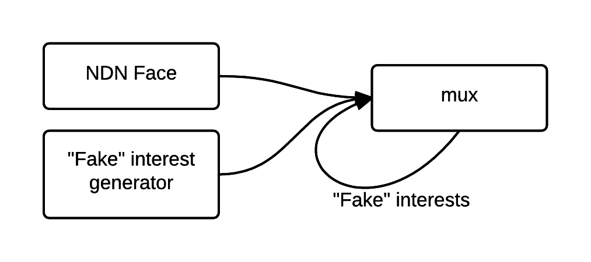

# Generate Data Before Interest

Remember, `mux` is a reactive framework; it assumes that data packet is produced on interest. However sometimes we want to pre-generate data packets. There are two ways to do this with `mux`:

1. Directly add data packets to content store
2. Fake interest to trigger data generation __(recommended)__

## Idea 1: Directly Add Data Packet to Content Store

The idea is simple: after we add data packets to content store, and use the proper cacher middleware, `mux` should be able to answer interests directly. In this tutorial, we are going to use `mux.RawCacher`.

> __mux.RawCacher(ndn.Cache, cpy)__ returns a middleware for caching data packets. When `cpy` is true, a data packet is copied when it is written or read from cache. When `cpy` is false, no copying is done; it is useful if you don't need to change data packets and want more performance.

> All ndn.Cache implementations in go-ndn are assumed to be thread-safe.

To publish data, you need to create one ndn.Cache. In this case, we choose to use `persist.Cache` because the default in-memory content store is not persistent.

```go
// create new cache
// With this cache `c`, you can publish data packets from any go-routine.
c := persist.NewCache("published.db")

// publish data
c.Add(chunk1)
c.Add(chunk2)

m := mux.New()
// use cacher middleware created from this cache
// cpy is set to false because persist.Cache
// marshals and unmarshals data packet to bytes
m.Use(mux.RawCacher(c, false))
...
```

## Idea 2: Fake Interest

The idea above that uses `mux.RawCacher` assumes that you properly prepare data packets without `mux`. An alternative way is to let `mux` do all this for you.

Do you still recall how we setup `mux` from the basic tutorial?

```go
// create a new face
recv := make(chan *ndn.Interest)
face := ndn.NewFace(conn, recv)
defer face.Close()

// ... use either mux.Cacher or persist.Cacher

// pump the face's incoming interests into the mux
m.Run(face, recv, key)
```

We create a channel so that the ndn face can pipe interest in; then we feed the channel output to `mux`. By injecting fake interests to `mux`, `mux` treats those interests as if they come out of the ndn face; we just need to use some cacher middleware.

```go
// inject fake interest and trigger another pipeline
// it blocks; use go-routine for non-blocking call
m.ServeNDN(face, &ndn.Interest{
  Name: ndn.NewName("/fake"),
})
```



__"Fake interest" pattern__ allows developers to achieve complex data packet generation by writing only __single-pass__ pipeline.
